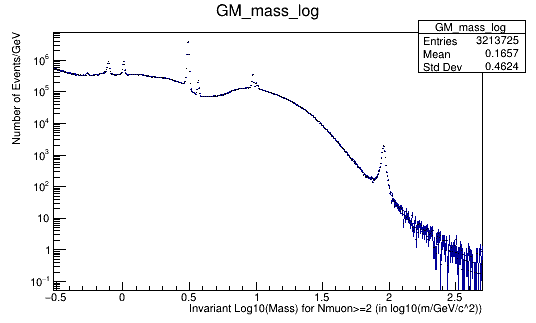
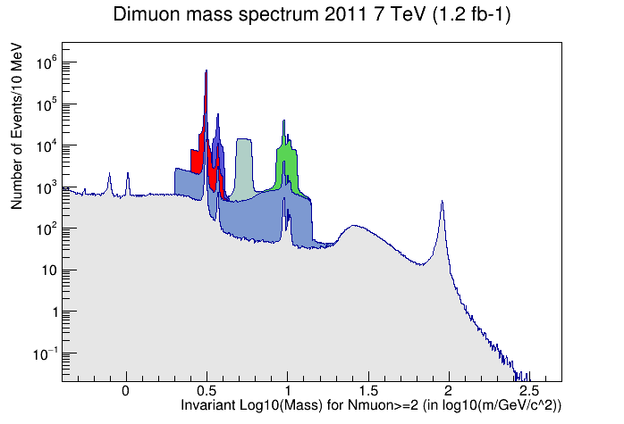
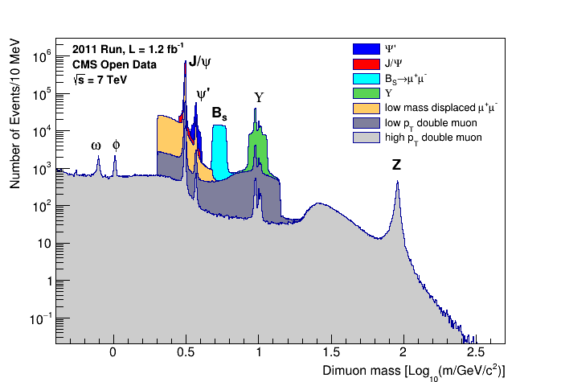
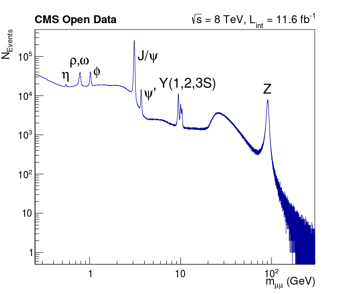

# NanoAODRun1Examples

Public usage examples for NanoAODRun1 are being provided here to illustrate how CMS Open Data in a NanoAOD or NanoAOD-like format can be analyzed to (re)produce a histogram of a physics observable -- specifically, the dimuon mass spectrum. These examples highlight the fact that analysis code for NanoAOD files is the same irrespective of data taking year or era, and can be analyzed with almost any version of ROOT (or ROOT-compatible) software (see e.g. ROOT User's guide, the python interface PyROOT, the RDATAframe framework, uproot, etc. ...) with any modern operating system.

More information on these examples can also be found in this [CERN TWiki](https://twiki.cern.ch/twiki/bin/view/CMSPublic/NanoAODRun1Examples), and this [CMS Open data workshop presentation](https://indico.cern.ch/event/1139022/contributions/4969980/attachments/2488290/4273320/NanoAODRun1ODWS.pdf).

CMS anticipates that about 50% of its publishable physics analyses can be performed using information stored in the NanoAOD format. For Run 1 Open Data, the NanoAOD format can be mimicked by processing AOD files through the [NanoAODRun1ProducerTool](https://opendata-qa.cern.ch/record/12505) (FIXME: remove qa). This tool is not intended to be pedagogical, but can be run using the CMSSW docker containers or virtual machines. The NanoAOD files needed for these analysis examples are available on the Open Data Portal as derived datasets.

Users interested in pedagogical code at AOD level are referred to the [POET framework](https://opendata.cern.ch/record/12501), which can be used to create NanoAOD-like files with content customized by the user. 

## Installation

The best way run these examples is to access the ROOT docker container described on the [Open Data Portal docker guide](https://opendata.cern.ch/docs/cms-guide-docker). You can also install [ROOT](https://root.cern.ch) locally on your computer. You will need a relatively recent ROOT version and the [XRootD package](https://xrootd.slac.stanford.edu/index.html) installed.

Clone this repository to access the example scripts:

```
$ git clone https://github.com/cms-opendata-analyses/NanoAODRun1Examples.git
$ cd NanoAODRun1Examples/
```

In the ROOT docker container, X11 graphics can be viewed using the built in VNC connection. In the container, execute:
```
$ start_vnc
...output...
```
Paste the URL into your browser and select "connect". Provide the default password `cms.cern`. At the end of your session, stop the VNC connection by executing `stop_vnc`

## 2010 Open Data example

Create a histogram of the dimuon mass spectrum in 2010 data by running:

```
$ cd dimuon_2010/
$ root -l -b -q MuHistos_eospublic.cxx++
```

Depending on network connection, this might take about 40 minutes. The script will produce a ROOT file containing several histograms. Reading the script will show you how to:

* Open ROOT files over the network
* Create histograms
* Extract a data tree from the input file
* Loop over the tree, accessing one event at a time
* Make event selections using branches in the tree
* Fill histograms with physics observables
* Write the histograms to an output file

To draw the mass spectrum:
```
$ start_vnc # only if not done already in this session
$ root -l MuHistos_Mu_eospublic.root
root [1] GM_mass_log->Draw()
root [2] .q
```



This result is almost identical to a published result in [this paper](https://inspirehep.net/literature/1118729).

Another example script, called `MuHistos_publicchain.cxx++`, performs the same analysis, but shows how to read many individual files into a `TChain` using wildcards, rather than reading a single merged ROOT file.

## 2011 Open Data example

For 2011 data, NanoAODRun1 files can be used to demonstrate a basic analysis workflow using standard `TTree` selection methods or the [RDataFrame]() package. 

The TTree example script shows how the `TTree->Draw()` method can be used to apply event selections during histogram creation. It also shows how to create a plot canvas
with multiple histograms using varied plotting styles. 

To run the TTree example (this may take several hours, depending on network connection):
```
$ start_vnc # only if not done already in this session
$ cd dimuon_2011/
$ root -l Dimuon2011_eospublic.C
```

You will see a plot similar to Figure 11 in [this Conference Report](https://inspirehep.net/literature/1292243)


The RDataFrame script produces the same plot in the end, but shows how to process a NanoAOD file through RDataFrame actions such as `Filter()`, `Define()`, and `Histo1D()`. 

To run the RDataFrame example (this should be much quicker, 10-20 minutes), first determine how many threads are accessible on your machine. If you wish to use fewer than 12 threads, edit the file `dimuon_2011/Dimuon2011_eospublic_RDF2.C` in a text editor and reduce the `nThreads` variable to a smaller number.
```
$ start_vnc # only if not done already in this session
$ cd dimuon_2011/
$ root -l root -l Dimuon2011_eospublic_RDF2.C
```

You will see a plot similar to Figure 68 in [this paper](https://inspirehep.net/literature/1485699).


To close the ROOT session after viewing either plot, enter `.q` at the ROOT prompt. Remember to use `stop_vnc` to close the docker container graphics connection when you are finished with your session.

## 2012 Open Data example

NanoAOD-like outreach files have been produced for 2012 data in a very lightweight format that contains only the muon information. An outreach example analysis using these files can be found at [this Open Data Portal record](https://opendata.cern.ch/record/12342). However, the same type of analysis can be performed using full NanoAODRun1 (or newer NanoAOD) files. 

2012 examples using NanoAODRun1 files exist in both ROOT C++ and PyROOT forms. The scripts are functionally identical and both use the RDataFrame method for quicker speeds, but show the differences between using RDataFrame in C++ versus Python. 

To run the C++ script:
```
$ start_vnc # only if not done already in this session
$ cd dimuon_2012/
$ root -l dimuonSpectrum2012_eospublic.C
```

To run the Python script:
```
$ start_vnc # only if not done already in this session
$ cd dimuon_2012/
$ python dimuonSpectrum2012_eospublic.py
```

You will see a plot like this:


Close the ROOT session using `.q`, or exit python using `exit()`. Remember to use `stop_vnc` to close the docker container graphics connection when you are finished with your session.

## Downloading files locally

All of these examples use the XRootD protocol to stream the data files over your network connection. If you prefer to download the files locally (you'll need some disk space!)
this can be done using `xrdcp`. In the ROOT container, a command like this will download the stated file (from the 2010 example) locally:

```
$ xrdcp root://eospublic.cern.ch//eos/opendata/cms/derived-data/NanoAODRun1/01-Jul-22/MuHistos_Mu_eospublic.root .
```

This download may be slow, depending on your network connection and the size of the files, but only needs to be done once. 
To use the local files, the `TFile::Open` commands in the example scripts should be edited to replace the entire `root://eospublic.cern.ch/..../FILE.root` file name with the local file path. 
